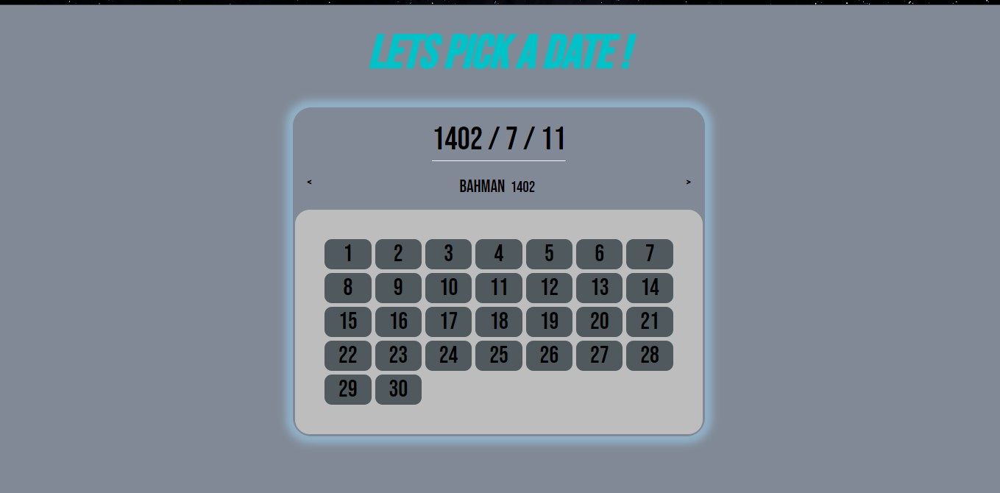

#Date Picker

##Installation
###There is no special installation needed:)

##instruction
###This app allows you to choose a jalali date .
###By clicking on next/prev arrow you move to one month later/ago.
###By double-click on each day element you can change your date, and it will display on the
###the top of calendar in (YYYY/M/D) format.
###By click on the calendar showing date you can disappear/appear the calendar section. 

